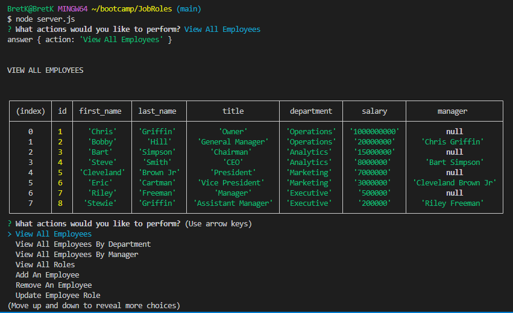

# Employee Job Roles

## Description

This is a script that keeps track of employees and their roles, departments, and salaries. It uses a MySQL database to store the information.

- What was your motivation? To help one company keep track of their employees.
- To learn how to use MySQL and Node.js together.
- It keeps track of employees and their roles, departments, and salaries.
- I learned how to use MYSQL and use the correct NPM packages.

## Images

## Installation

You must use NPM to install the following packages:
dotenv 16.3.1
express 4.18.2
inquirer 8.2.6
mysql2 3.6.0

## Usage

Use node server.js to open the program.
You will need the up and down arrows to navigate the menu.
You will need to use the enter key to select the options.
You will need to use the up and down arrows to navigate the lists.

## Video Link

https://drive.google.com/file/d/1MRUCWpactfJzXAs_Jh51gbdh_Ea3DAVb/view

## License

MIT License.

Copyright (c) [2023] [BretKruse]

Permission is hereby granted, free of charge, to any person obtaining a copy
of this software and associated documentation files (the "Software"), to deal
in the Software without restriction, including without limitation the rights
to use, copy, modify, merge, publish, distribute, sublicense, and/or sell
copies of the Software, and to permit persons to whom the Software is
furnished to do so, subject to the following conditions:

The above copyright notice and this permission notice shall be included in all
copies or substantial portions of the Software.

THE SOFTWARE IS PROVIDED "AS IS", WITHOUT WARRANTY OF ANY KIND, EXPRESS OR
IMPLIED, INCLUDING BUT NOT LIMITED TO THE WARRANTIES OF MERCHANTABILITY,
FITNESS FOR A PARTICULAR PURPOSE AND NONINFRINGEMENT. IN NO EVENT SHALL THE
AUTHORS OR COPYRIGHT HOLDERS BE LIABLE FOR ANY CLAIM, DAMAGES OR OTHER
LIABILITY, WHETHER IN AN ACTION OF CONTRACT, TORT OR OTHERWISE, ARISING FROM,
OUT OF OR IN CONNECTION WITH THE SOFTWARE OR THE USE OR OTHER DEALINGS IN THE
SOFTWARE.
